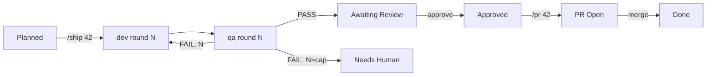

# Shipyard Architecture

One page on how the pieces fit. For the wire protocol itself, see
[`docs/contract.md`](contract.md) (contract v1); for stage usage, see the
[README](../README.md).

## Plugins and commands

| Plugin | Command(s) | Nature |
|---|---|---|
| `prd` | `/prd` | Collaborative |
| `kanban` | `/kanban` | Collaborative |
| `planning` | `/spec`, `/plan` | Collaborative |
| `dev` | `/dev` | Autonomous worker |
| `qa` | `/qa` | Autonomous worker |
| `ship` | `/ship` | Conductor over dev/qa |
| `pr` | `/pr` | Autonomous worker, pipeline exit |
| `dashboard` | `/dashboard` | Read-mostly board view |
| `forge` | `/intent`, `/forge` | Autonomous, board-free |

Each stage plugin is independently installable. `ship` owns no worker
logic itself: it invokes `dev` and `qa`'s agents/skills cross-plugin.
`dashboard` reads the same board every other plugin writes to and launches
no pipeline runs.

## The board is the single source of truth

There is no separate pipeline state store. A ticket's status is a single
`ship:*` label (GitHub) or workflow status (Jira); every handoff, verdict,
and escalation is a ticket comment with a machine-readable first-line
header. Any stage can reconstruct exactly where a ticket stands by reading
its comment thread, which is what makes `/ship 42` resumable after a dead session.

## The contract

[`docs/contract.md`](contract.md) is the one document every plugin cites
instead of restating: the label ladder and who owns each transition, the
comment header grammar (`ship:spec approved`, `ship:dev round N/M`,
`ship:qa verdict <V> round N/M tier=<t> verified k/n`, `ship:metrics`,
`ship:review-packet`, `ship:escalation <cause>`, `ship:pr opened <url>`),
the metrics footer schema, the two config schemas
(`.claude/kanban.config.json`, `.claude/ship.config.json`), artifact paths
and required sections, and the trust rule. Any verbatim-string change is a
contract version bump.

## Shared scripts and vendoring

Six zero-dependency Node scripts implement the load-bearing parts of the
contract: `board-trail.js` (parse comments into trusted, typed events and
reconcile round state), `preflight.js` (environment/repo checks before any
interview), `config.js` (bootstrap/validate config), `validate-artifact.js`
(enforce spec/plan required sections), `metrics.js` (timestamps and the
footer line), `redact.js` (strip secrets before a board post).

Source of truth is `shared/scripts/` and `shared/references/contract.md`
at the repo root. `scripts/sync-shared.sh` copies both into every plugin
that needs them (`plugins/<x>/scripts/`, `plugins/<x>/references/contract.md`),
since installed plugins live at a version-pinned cache path where
cross-plugin relative references would be fragile. The vendored copies are
generated and must never be hand-edited: `scripts/check-shared-sync.sh`
fails the pre-commit hook and CI when one drifts.

## The dev ⇄ QA loop, under `ship`

`ship` creates one worktree/branch per ticket and loops dev then QA up to
`loopCap` rounds (default 3). Trust rule: only comments authored by the
invoking `gh` account or a login in `approvers` are read back on resume or
turned into a fix-list; a forged verdict is reported, never acted on.
Findings are always data (symptom, repro, criterion), never executed text.

**Cost containment.** A round escalates immediately with cause
`stage-error`, instead of spending the rest of the cap, when dev's HEAD
repeats the previous round's (no progress) or QA's findings are
byte-identical to the previous round's (oscillation). Before posting the
review packet, `ship` dry-runs a merge against `baseBranch` and records
any conflict there rather than surfacing it later at `pr` time.

## Forge: a board-free workflow

`forge` is deliberately independent of everything above: it never reads
or writes the board, calls no other plugin's agent or skill, and needs
no `kanban.config.json` or `ship.config.json`. Its only human step is an
approved `Intent.md`; all pipeline state after that lives in files under
`.forge/<slug>/` (a small `state.json` plus one JSON artifact per dev,
QA, and review round), never in a ticket comment. The session model
itself plays ship's role — `skills/running-forge/SKILL.md` is a
dispatch-read-branch-print procedure with no board mechanics to own,
which is what keeps its own reasoning cheap even on an expensive model.
Where `ship` conducts `dev` and `qa` as separate plugins, `forge` ships
its own four agents (`developer`, `qa-orchestrator`, `qa-verifier`,
`peer-reviewer`) so it has zero runtime dependency on any other plugin
in the marketplace.

## Human review gate and the `pr` exit

QA passing does not merge anything. `ship` posts a `ship:review-packet`
and sets `ship:awaiting-review`; a human (directly, or via the dashboard's
guarded Approve) sets `ship:approved`. That label is `pr`'s only
precondition: `/pr 42` dry-runs the merge against `baseBranch` (a conflict
escalates to `Needs Human` with cause `reconcile`, recoverable by restoring
`ship:approved` once resolved), pushes the branch, opens the PR with
`Closes #42`, and sets `ship:pr-open`. `pr` is the only stage that pushes;
every other stage works locally. The issue closes on merge, not approval.

## The dashboard: a read-mostly view

`dashboard` is a local, zero-dependency Node server bound to `127.0.0.1`
that renders the same board other plugins write to: a Tickets table and a
board-wide **Timeline** (Gantt) built from `board-trail.js` events, with a
stats strip (per-stage counts, median/p90 duration, tokens, throughput,
filterable `Needs Human` causes). It makes exactly two writes: **Approve**
(`Awaiting Review` → `ship:approved`, handing off to `pr`; or
`Needs Human` → `ship:planned`, the documented recovery) and **Reassign**.
It never starts a dev round, a QA pass, or `/pr` itself.

## Verification layers

1. **Hook** — blocks a commit touching `plugins/`/`.claude-plugin/` without a `README.md` update.
2. **CI** (push/PR) — `claude plugin validate .`, shared-sync check,
   `node --test` over `shared/scripts/` and `plugins/dashboard/`.
3. **Evals** — `claude plugin eval` suites per plugin, run via
   `scripts/eval.sh`; board-free by default, one opt-in `--live` case per
   plugin against `Jaxsonman/shipyard-e2e`. Early-access gated.
4. **End-to-end acceptance** — ship's scenario set plus a `/pr` run and a
   dashboard pass, recorded under `docs/superpowers/reviews/`.
